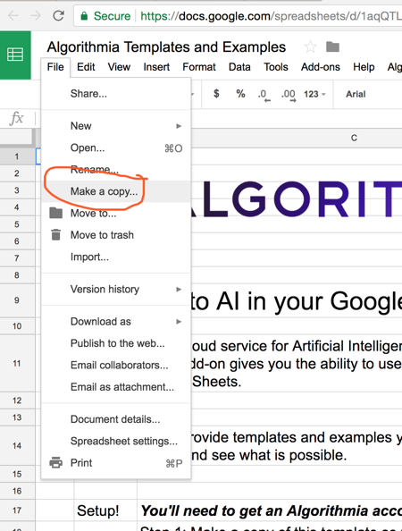
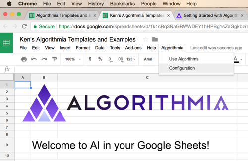
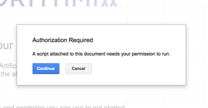
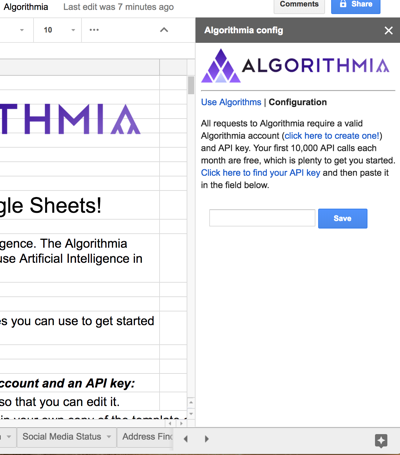
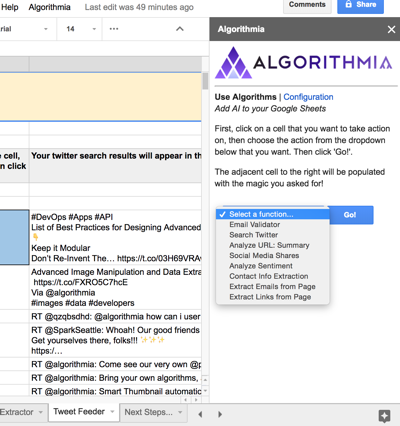
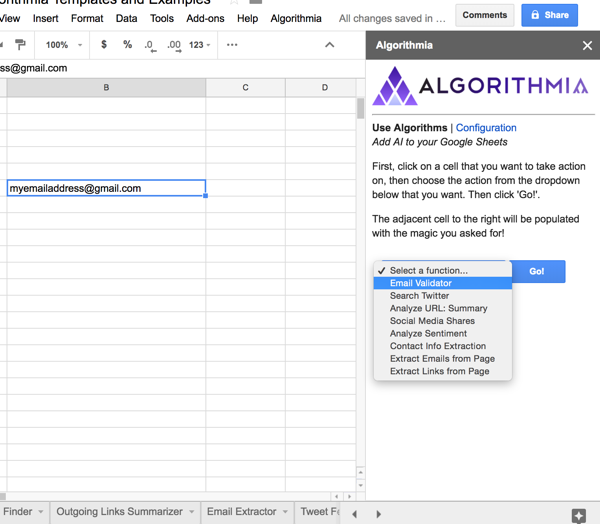
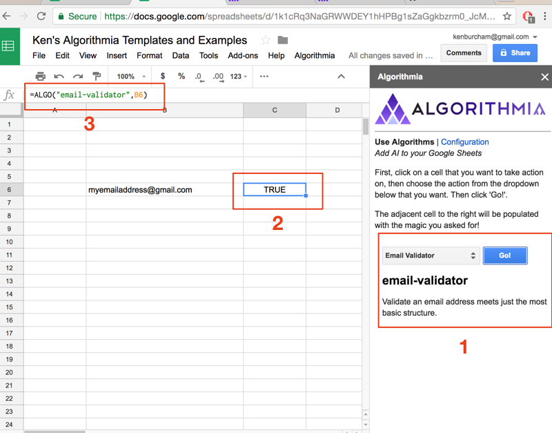
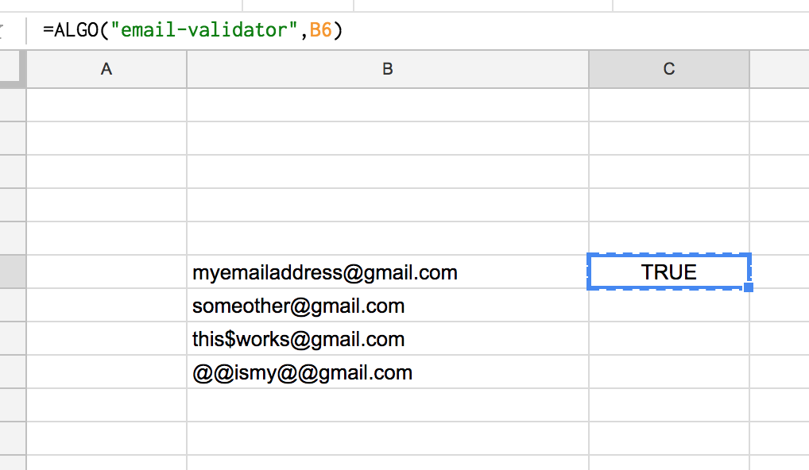
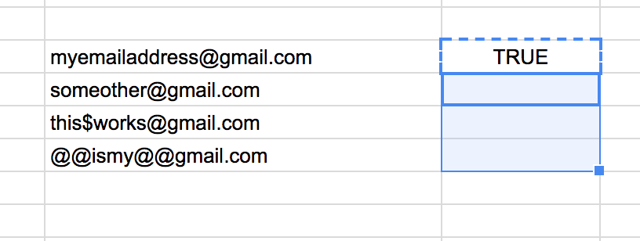
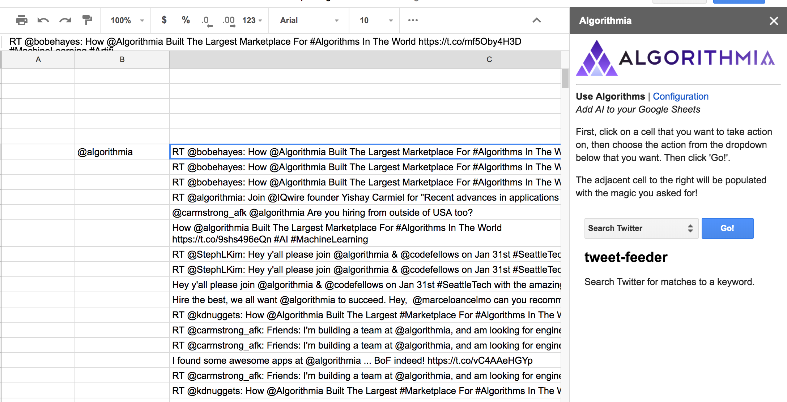

# Google Sheets + AI

Google Sheets is a collaborative, extensible online spreadsheet tool used by students and executives around the world. With the explosion of Artificial Intelligence, you might ask yourself, 

> "How can I get the benefits of AI in my spreadsheet?"

In this article, we'll introduce you to Algorithmia's Google Sheet Add-on that enables you to add algorithms running on Algorithmia's cloud infrastructure right that can act on your own data in your Google Sheet.

Algorithmia offers a serverless, scalable GPU cloud for scalable AI algorithms. Developers can create and host sophisticated AI functions and learning models that can do machine learning tasks like visual recognition, sentiment analysis, natural language summaries as well as handy utilities like validating email addresses, extracting URLs or snail mail addresses from a website. 

Typically, a developer connects these functions into their software programs, but with the Google Sheets add-on, we can integrate these powerful abilities directly into the business tools we use every day.

Let's see how this works!

## Objective 1: Get your Algorithmia API key
First, you'll need to setup a [free Algorithmia account](https://algorithmia.com/signup) which includes 5,000 free credits a month, and copy your API key found under [My Profile](https://algorithmia.com/user#credentials) > Credentials. You need an API key to setup your Algorithmia Google Sheet's Add-on. 

Highlight your key and copy it to your clipboard (or someplace you can easily get it).

## Objective 2: Copy the Google Sheets Algorithmia Template

Open this Google Sheets template that includes the Algorithmia Add-on and then make your own copy so that you can edit it.

[Algorithmia Templates and Examples](https://docs.google.com/spreadsheets/d/1aqQTLqrGcKoro52X50U7npOvgj0AD33azWh_3XpZbD0/edit?usp=sharing)

Once you open the sheet, click File -> Make a copy. Name it whatever you like and then save it:

Now you just need to configure your API key and you can start exploring the examples in the template.

## Objective 3: Configure your API Key
With your copy of the Template open, click the Algorithmia menu that is added auto-magically by the Algorithmia Add-on, and then choose "Configuration":

The first time that you run the Add-on, it will ask you to grant it the permissions that it needs to run. Click "Continue" and then review the permissions the script requires and then accept if you choose to continue.

Once you the script is authorized, the Configuration side panel will appear. Paste in the API key you copied in Objective 1 and click "Save".

When you've saved the key, you can close the sidebar.

## Objective 4: Explore the Templates and Examples
The Algorithmia Templates and Examples Google Sheet provides many tabs along the bottom for you to explore some ways you can use Artificial Intelligence algorithms on your own data.

Some of the examples run a single algorithm, some chain together two or more. Also, of course, since you're running inside a spreadsheet, you can still use any of the formulas, filtering, conditionals that you can do in your spreadsheet.

You will find the following examples in the tabs along the bottom of the sheet:
* Summary and Sentiment - Summarize a webpage and analyze the tone of the language; is it positive or negative?
* Email Validation - Given a list of emails (perhaps from a newsletter list) validate them to ensure they are properly conformant.
* Social Media Status - How many Facebook likes, shares and comments does your website have? You could track this daily or weekly and create trend analysis to monitor the effectiveness of a campaign.
* Address Finder - Crawls a website and extracts the primary contact snail mail address.
* Outgoing Links Summarizer - Pulls in all of the outgoing links on a webpage (those that will take you off the site) and then generates a summary for each. Handy for generating your daily news page!
* Email Extractor - Scrapes a webpage and discovers all of the email addresses and adds them to your spreadsheet. Not for use with spam! But useful for finding a sales contact you were looking for.
* Tweet Feeder - Loads recent tweets that match a keywork and copies them into your sheet. You could then run the sentiment function and sort on negative tweets for statistical analysis.

Each of these examples has a tab with instructions and explanation. We encourage you to work through each one to understand how you might use these templates in your own workflow.

## Objective 5: Work with the "Use Algorithms" sidebar

### Part 1: Introduction to the ALGO formula

If you work through the examples, you'll become familiar with the Use Algorithms sidebar, but maybe you just want to jump right in and try a few yourself. That's pretty much what I would do.

First, make a new tab (click the + icon at the bottom left that will say "Add Sheet") and name it whatever you like.

Second, click the Algorithmia menu and choose "Use Algorithms". The sidebar pictured above will open.

Now, let's try out that email address validation. Click in any cell and type in your email address. Then choose "Email Validator" from the function dropdown in the sidebar and click "Go!". NOTE: Make sure you still have your email address selected when you click the Go button.

The Algorithmia Add-on will fire off a call to the API and run the validation function and return the result into your sheet:

Now there are several things to notice. Follow the numbers in red:

1. When you select an algorithm from the dropdown, it will display a short description of what you can expect it to do for you when you click Go.

2. Once you click Go, then the result of your function will be displayed into the cell adjacent to your selection. This is one of two possible behaviors of functions. Some functions will copy results to the RIGHT adjacent cells and some will copy DOWN. It depends on the kind of function you are calling.

3. Notice that what the sidebar ACTUALLY did for you is accomplish the email validation with a Google Sheet formula! The Add-on provides a formula called "ALGO" that you can use anywhere to call any configured Algorithmia algorithm in any cell of your spreadsheet. In other words, you don't need to use the sidebar to insert it, once you get familiar with the available algorithm names. Not all algorithms use ALGO; some are more complex. But many can be called with the formula. That also means you can copy and paste that formula down and it will act on each cell, in the normal spreadsheet way...

To try using the formula this way, click on the result of your email validation. In my example, that is cell C6:

Then click COPY (command-C or ctrl-C) and then highlight the range below C6 (C7-C9):

And then click PASTE (command-V or ctrl-V). The Sheet will fill in that formula and call the algorithm for each cell. Cool!

>N.B.: For developers out there, the good news is that you can open up the script editor and you have all the code you need to add more algorithms or write your own formulas!

### Part 2: Algorithms that return lots of information

The sidebar provides two kinds of algorithms, ones that are used via the ALGO formula and also ones that are more complex and can ony be run on-demand.

In this example, let's run the recent twitter matches on a keyword. You can delete all of the cells in your sheet and then type "@algorithmia" into a cell. Click that cell, then in the sidebar choose "Search Twitter" and click "Go!". Your results should look similar to this: 

Notice how the filled in results are NOT an ALGO formula but the actual text content from the tweet? Since this algorithm returns a list of items, it copies the text from each result into the adjacent cell, moving DOWN the column.

This is an example of an algorithm that is run on-demand through the sidebar instead of through the ALGO formula because it returns more than one value and so must be copied into many cells.

## Conclusion and next steps

The Algorithmia Google Sheets add-on enables you to bring Algorithmia's hosted AI algorithms into your spreadsheets so that you can accomplish powerful workflows! Its like AI power tools in your spreadsheet!

While Algorithmia has thousands of algorithms, the add-on currently supports only a select handful. We will add more and more as time goes on, focusing on use cases that offer value for use in spreadsheets. Let us know if you have some you'd like to add. Or if you're a developer, roll up your sleeves and add it yourself into your own copy of the add-on. 

Enjoy!

